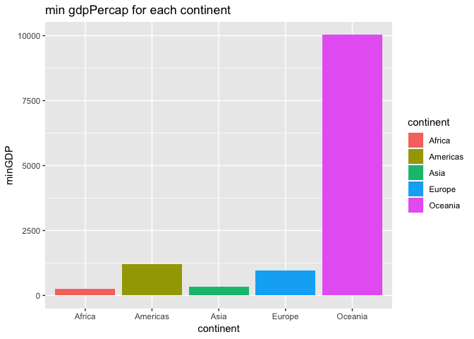
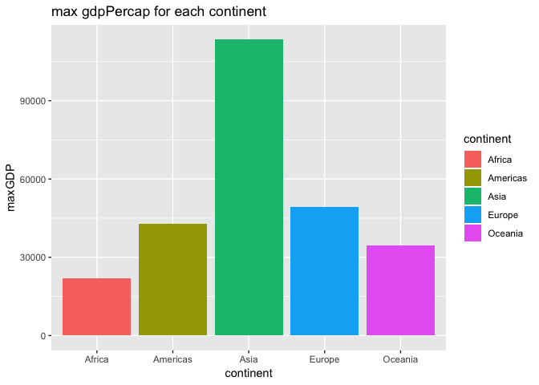
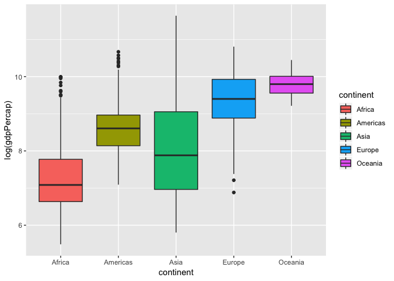
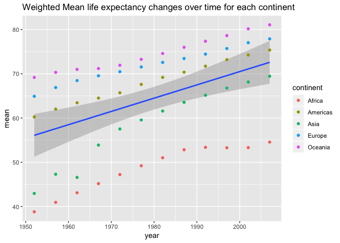
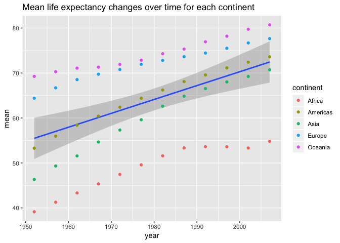
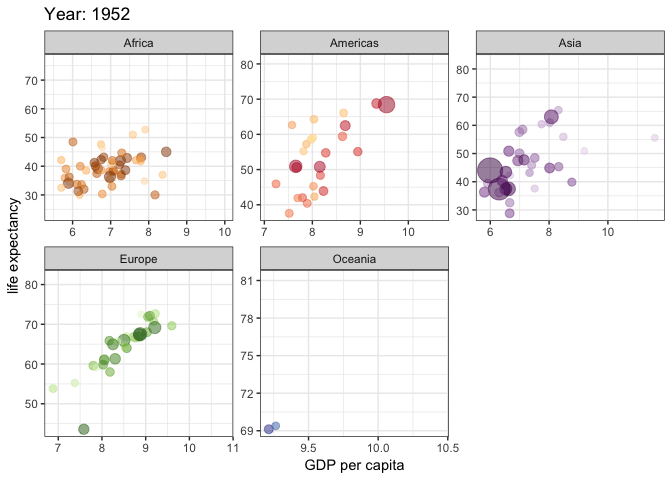
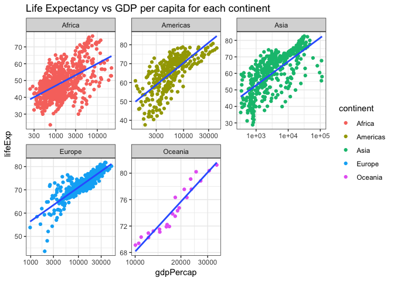
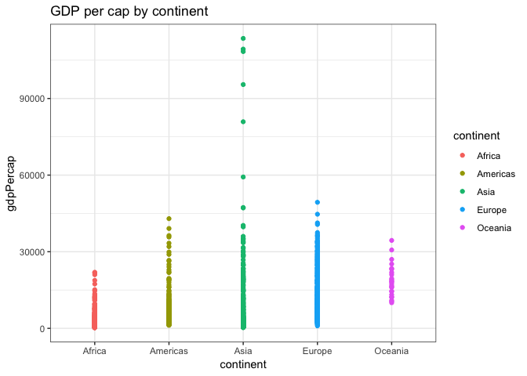

Homework 03: Use dplyr/ggplot2 to manipulate and explore data
================

``` r
suppressPackageStartupMessages(library(tidyverse))
suppressPackageStartupMessages(library(gapminder))
```

``` r
library(gapminder)
library(tidyverse)
library(gganimate)
```

#### Task \#1 Get the maximum and minimum of GDP per capita for all continents.

``` r
gdpPercap_continent <- gapminder %>% 
  group_by(continent) %>% 
  summarise(minGDP = min(gdpPercap), maxGDP = max(gdpPercap)) 

knitr::kable(gdpPercap_continent, col.names = c("Continnet", "min gdpPercap", "max gdpPercap"))
```

| Continnet |  min gdpPercap|  max gdpPercap|
|:----------|--------------:|--------------:|
| Africa    |       241.1659|       21951.21|
| Americas  |      1201.6372|       42951.65|
| Asia      |       331.0000|      113523.13|
| Europe    |       973.5332|       49357.19|
| Oceania   |     10039.5956|       34435.37|

Then, plot the figures.

##### The minimum gdpPercap for each continent:

``` r
gdpPercap_continent %>% 
  ggplot(aes(continent, minGDP, fill=continent)) + 
  geom_bar(stat="identity") +
  ggtitle("min gdpPercap for each continent")
```



##### The maximum gdpPercap for each continent:

``` r
gdpPercap_continent %>% 
  ggplot(aes(continent, maxGDP, fill=continent)) + 
  geom_bar(stat="identity") +
  ggtitle("max gdpPercap for each continent")
```



#### Task \#2 Look at the spread of GDP per capita within the continents.

Generate the spread of GDP per capita for each continent by calculating the minimum, mean, median, and maximum of gdpPercap

``` r
gapminder %>% 
  group_by(continent) %>% 
  summarise(min = min(gdpPercap), mean = mean(gdpPercap), 
            median = median(gdpPercap), max = max(gdpPercap)) %>% 
  knitr::kable()
```

| continent |         min|       mean|     median|        max|
|:----------|-----------:|----------:|----------:|----------:|
| Africa    |    241.1659|   2193.755|   1192.138|   21951.21|
| Americas  |   1201.6372|   7136.110|   5465.510|   42951.65|
| Asia      |    331.0000|   7902.150|   2646.787|  113523.13|
| Europe    |    973.5332|  14469.476|  12081.749|   49357.19|
| Oceania   |  10039.5956|  18621.609|  17983.304|   34435.37|

``` r
gapminder %>% 
ggplot(aes(continent, log(gdpPercap), fill=continent)) + 
  geom_boxplot()
```



#### Task \#3 Compute a trimmed mean of life expectancy for different years. Or a weighted mean, weighting by population. Just try something other than the plain vanilla mean.

I calcualte the weighted mean of life expectancy by pop for each continent and plot the change over time as followng:

``` r
gapminder %>% 
  select(continent, year, lifeExp, pop) %>% 
  group_by(continent, year) %>% 
  summarise(mean = weighted.mean(lifeExp, pop)) 
```

    ## # A tibble: 60 x 3
    ## # Groups:   continent [?]
    ##    continent  year  mean
    ##    <fct>     <int> <dbl>
    ##  1 Africa     1952  38.8
    ##  2 Africa     1957  40.9
    ##  3 Africa     1962  43.1
    ##  4 Africa     1967  45.2
    ##  5 Africa     1972  47.2
    ##  6 Africa     1977  49.2
    ##  7 Africa     1982  51.0
    ##  8 Africa     1987  52.8
    ##  9 Africa     1992  53.4
    ## 10 Africa     1997  53.3
    ## # ... with 50 more rows

``` r
gapminder %>%
  group_by(continent, year) %>% 
  summarise(mean = weighted.mean(lifeExp, pop)) %>% 
  ggplot(aes(year, mean)) +
  geom_smooth(method="lm", se=TRUE) + # linear regression 
  geom_point(aes(colour = continent)) +
  ggtitle("Weighted Mean life expectancy changes over time for each continent")
```



#### Task \#4 How is life expectancy changing over time on different continents?

I calcualte the mean of life expectancy for each continent and plot the change over time as followng:

``` r
gapminder %>% 
  select(continent, year, lifeExp, pop) %>% 
  group_by(continent, year) %>% 
  summarise(mean = mean(lifeExp)) 
```

    ## # A tibble: 60 x 3
    ## # Groups:   continent [?]
    ##    continent  year  mean
    ##    <fct>     <int> <dbl>
    ##  1 Africa     1952  39.1
    ##  2 Africa     1957  41.3
    ##  3 Africa     1962  43.3
    ##  4 Africa     1967  45.3
    ##  5 Africa     1972  47.5
    ##  6 Africa     1977  49.6
    ##  7 Africa     1982  51.6
    ##  8 Africa     1987  53.3
    ##  9 Africa     1992  53.6
    ## 10 Africa     1997  53.6
    ## # ... with 50 more rows

``` r
gapminder %>%
  group_by(continent, year) %>% 
  summarise(mean = mean(lifeExp)) %>% 
  ggplot(aes(year, mean)) +
  geom_smooth(method="lm", se=TRUE) + # linear regression 
  geom_point(aes(colour = continent)) +
  ggtitle("Mean life expectancy changes over time for each continent")
```



To get better visualization of how the life expectancy changes over time on different continents, I used the `gganimate` library to generate dynamic figures (gif).

``` r
theme_set(theme_bw())  # pre-set the bw theme.
gapminder %>% 
  ggplot(aes(log(gdpPercap), lifeExp, size = pop, colour = country)) +
  geom_point(alpha = 0.5, show.legend = FALSE) +
  scale_colour_manual(values = country_colors) +
  scale_size(range = c(2, 12)) +
  facet_wrap(~continent, scales = "free") +
  # Here comes the gganimate specific bits
  labs(title = 'Year: {frame_time}', x = 'GDP per capita', y = 'life expectancy') +
  transition_time(year) +
  ease_aes('linear')
```



#### Task \#4 Find countries with interesting stories. Open-ended and, therefore, hard. Promising but unsuccessful attempts are encouraged. This will generate interesting questions to follow up on in class.

The following figures show the `lifeExp` vs `gdpPercap` (in log) for each continent. As we can see, most of them have a linear corrolated relation. However, for Africa continent the data are broadly scattered. So if we look into the detailed data, we may find some interesting stories.

``` r
gapminder %>% 
  ggplot(aes(gdpPercap, lifeExp)) +
  scale_x_log10() + 
  geom_point(aes(color=continent)) + 
  geom_smooth(method="lm", se=FALSE) +
  facet_wrap(~continent, scales = "free") +
  ggtitle("Life Expectancy vs GDP per capita for each continent")
```



### But I want to do more!

``` r
library(ggplot2)
suppressMessages(library(dplyr))
#devtools::install_github("jennybc/gapminder")
library("gapminder")
gtbl <- tbl_df(gapminder)
```

    ## `summarise_each()` is deprecated.
    ## Use `summarise_all()`, `summarise_at()` or `summarise_if()` instead.
    ## To map `funs` over a selection of variables, use `summarise_at()`

| continent |       mean|     median|
|:----------|----------:|----------:|
| Africa    |   2193.755|   1192.138|
| Americas  |   7136.110|   5465.510|
| Asia      |   7902.150|   2646.787|
| Europe    |  14469.476|  12081.749|
| Oceania   |  18621.609|  17983.304|


